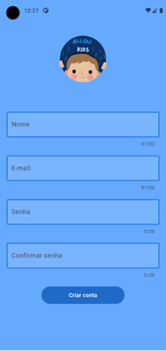
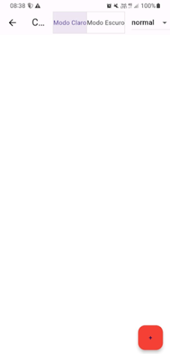
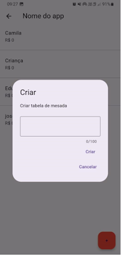
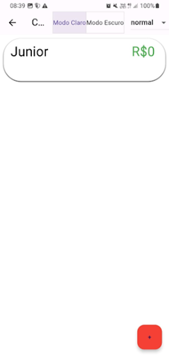
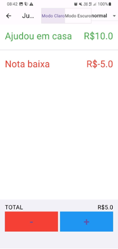
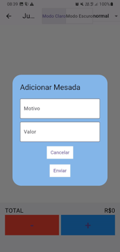
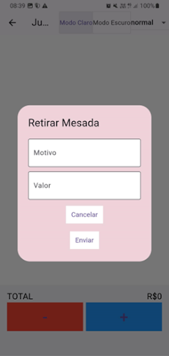

  

# 💰 Controle de Mesada

Aplicativo mobile desenvolvido em Flutter, voltado para pais ou responsáveis acompanharem e gerenciarem a mesada dos filhos de maneira simples e organizada.

## 📋 Descrição

O **Controle de Mesada** permite que os responsáveis possam criar contas, adicionar filhos, registrar ganhos e perdas de mesada com motivo e valor, mantendo um controle visual e interativo do total disponível. A interface é limpa, intuitiva e prática para o uso no dia a dia.

## 🔧 Tecnologias Utilizadas

- **Flutter**: Framework para desenvolvimento mobile.
- **Dart**: Linguagem utilizada no Flutter.
- **Firebase Authentication**: Autenticação de usuários.
- **Firebase Firestore**: Armazenamento de dados em tempo real.

## 🧠 Funcionalidades

- Cadastro e login de responsáveis com Firebase.
- Adição de filhos e criação de uma tabela individual de mesada.
- Registro de valores positivos (ganhos) e negativos (perdas) com motivo.
- Cálculo automático do total disponível de mesada.
- Armazenamento em nuvem com sincronização em tempo real.

## 📸 Capturas de Tela

### 🟦 Imagem 1 – Tela de Login  
  
Tela para que os responsáveis acessem sua conta no aplicativo.

### 🟦 Imagem 2 – Tela de Cadastro  
  
Tela para criação de nova conta com nome, e-mail e senha.

### 🟦 Imagem 3 – Tela Inicial  
  
Ao entrar no app, os responsáveis podem criar uma nova tabela de mesada para seus filhos.

### 🟦 Imagem 4 – Criação da Mesada para Criança  
  
Pop-up para adicionar uma nova tabela de mesada com o nome da criança.

### 🟦 Imagem 5 – Mesada Criada Exibida na Tela Inicial  
  
Lista com as crianças e seus respectivos saldos de mesada.

### 🟦 Imagem 6 – Dados da Mesada  
  
Detalhamento das movimentações de mesada, como adições e retiradas, com descrições.

### 🟦 Imagem 7 – Adicionar Mesada  
  
Pop-up onde o responsável pode inserir um valor e o motivo da adição da mesada.

### 🟦 Imagem 8 – Retirar Mesada  
  
Pop-up onde o responsável pode registrar o motivo e valor da retirada da mesada.

## 👤 Desenvolvedor

Este projeto foi desenvolvido como **Trabalho de Conclusão de Curso (TCC)** do curso técnico em Informática para Internet no ano de **2023**.

- **João Vitor Toledo da Silva** – Desenvolvimento completo do aplicativo, integração com o Firebase, lógica de controle de mesada e interface.
